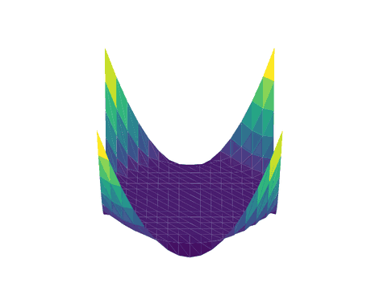

# MultiGridBarrier.jl

[](https://sloisel.github.io/MultiGridBarrier.jl/stable/)
[](https://sloisel.github.io/MultiGridBarrier.jl/dev/)
[](https://github.com/sloisel/MultiGridBarrier.jl/actions/workflows/CI.yml?query=branch%3Amain)
[](https://codecov.io/gh/sloisel/MultiGridBarrier.jl)

<p align="center">
  
</p>

**Quasi-optimal solvers for convex variational problems.** `MultiGridBarrier.jl` solves
nonlinear PDEs and boundary-value problems, including the *nonsmooth* ones that defeat most
solvers: the p-Laplacian for every `p ∈ [1, ∞]`, total variation, and obstacle problems. The **multigrid barrier method** couples an
interior-point (barrier) method with a multigrid hierarchy to reach near-linear cost where that is
provably achievable. Finite elements in 1D/2D/3D (simplicial `P_k` and tensor-product `Q_k`) and
Chebyshev spectral discretizations, with optional CUDA GPU acceleration.

## Install and quickstart

```julia
using Pkg; Pkg.add("MultiGridBarrier")

using MultiGridBarrier
geom = fem2d_P2()                                 # a 2D P2 triangular mesh
sol  = mgb_solve(assemble(amg(geom); p = 1.0))    # solve a (nonsmooth) p = 1 problem
plot(sol)
```

`p = 1` is the hardest, nonsmooth case; larger `p` gives smoother problems. Swap `fem2d_P2()` for
`fem1d`, `fem2d`, `fem3d`, `fem2d_P1`, `spectral1d`, or `spectral2d`.

## Features

- **Convex variational problems / nonlinear PDEs & BVPs:** the p-Laplacian, total variation,
  obstacle-type constraints, and other convex functionals.
- **Discretizations:** finite elements in 1D/2D/3D (simplicial `P1`/`P2` and tensor-product `Q_k`),
  plus Chebyshev spectral elements; all isoparametric.
- **Solver:** an algebraic-multigrid hierarchy (`amg`) driving a barrier (interior-point) method.
- **Topological meshes:** slit domains, branch cuts, and glued manifolds via explicit connectivity
  (the `t=` keyword and `tensor_dofmap`).
- **GPU:** optional CUDA acceleration.
- **Time-dependent problems:** `parabolic_solve`.

## Documentation

[**Stable**](https://sloisel.github.io/MultiGridBarrier.jl/stable/) ·
[**Dev**](https://sloisel.github.io/MultiGridBarrier.jl/dev/) ·
[**Paper (PDF)**](https://sloisel.github.io/MultiGridBarrier.jl/paper.pdf)

## Bibliography

This package implements and builds on a growing line of work on barrier methods for convex problems
in function spaces. If you use it in your research, please cite the paper(s) most relevant to your
work:

- S. Loisel, *The spectral barrier method to solve analytic convex optimization problems in function
  spaces*, Numerische Mathematik **158**(1):281–302, 2026.
  [doi:10.1007/s00211-025-01508-0](https://doi.org/10.1007/s00211-025-01508-0)
- S. Loisel, *Efficient algorithms for solving the p-Laplacian in polynomial time*, Numerische
  Mathematik **146**(2):369–400, 2020.
  [doi:10.1007/s00211-020-01141-z](https://doi.org/10.1007/s00211-020-01141-z)

## Author

Sébastien Loisel.
